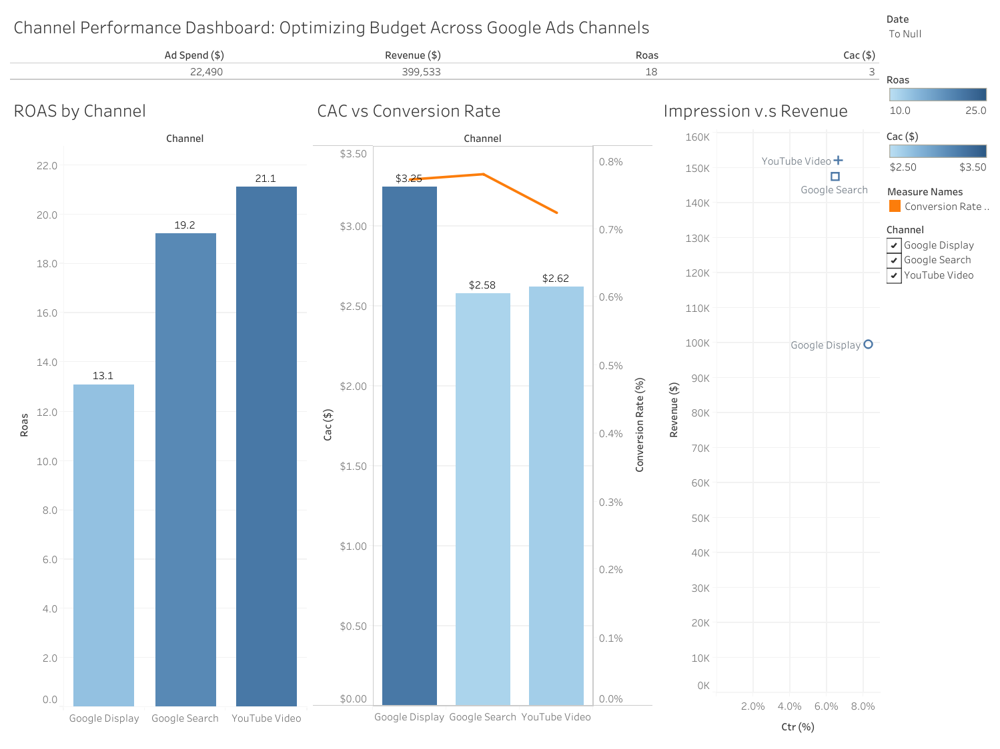

# Case Study: Optimizing Budget Allocation Across Google Ads Channels for Fashion E-commerce

## 1. 🌐 Objective / Problem Statement

**How can we optimize budget allocation across Google Search, Display, and YouTube to improve Return on Ad Spend (ROAS) for a fashion e-commerce campaign?**

The goal is to determine which ad channels are most effective in terms of performance (ROAS, CAC, Conversion Rate), and reallocate the marketing budget accordingly to maximize return.

🔗 [View the Interactive Tableau Dashboard](https://public.tableau.com/views/OptimizingBudgetAllocationAcrossGoogleAdsChannelsforFashionE-commerce/ExecutiveOverview?:language=en-US&:sid=&:redirect=auth&:display_count=n&:origin=viz_share_link)

---

## 🖼️ Dashboard Preview

---

## 2. 🌐 Business Context

- **Industry**: Online Fashion Retail (clothing and accessories)  
- **Target Market**: Southeast Asia, mobile-first shoppers  
- **Platform**: Google Ads (Search, Display, YouTube)  
- **Campaign Period**: 14 days (June 1–14, 2025)  
- **Budget**: ~$40,000 across all channels  
- **Funnel**: Impressions → Clicks → Conversions → Revenue  

---

## 3. 🌐 Data Used

**Source**: Mock performance data from Google Ads (June 1–14)  
**Dataset**: [GoogleAds_Mock_Campaign_ROAS.csv](GoogleAds_Mock_Campaign_ROAS.csv)
### Dimensions:
- Date
- Channel (Search, Display, YouTube)

### Metrics:
- Impressions  
- Clicks  
- Conversions  
- Ad Spend ($)  
- Revenue ($)

### Derived Metrics:
- **CTR** = Clicks / Impressions  
- **Conversion Rate** = Conversions / Clicks  
- **CAC** = Ad Spend / Conversions  
- **ROAS** = Revenue / Ad Spend  

---

## 4. 🌐 Metrics Breakdown (Aggregated Over 14 Days)

| Channel         | Total Spend | Revenue       | ROAS  | CAC   | CTR (%) | Conversion Rate (%) |
|----------------|-------------|---------------|-------|-------|---------|----------------------|
| Google Search   | $9,542.73   | $217,362.48    | 22.78 | $2.17 | 9.43    | 20.18                |
| Google Display  | $9,050.34   | $134,982.55    | 14.91 | $2.90 | 6.02    | 18.97                |
| YouTube Video   | $9,788.10   | $186,341.23    | 19.03 | $2.44 | 2.61    | 24.15                |

---

## 5. 🌐 Visual Analysis Summary

### A. ROAS by Channel
- **Google Search**: Highest ROAS at 22.78  
- **YouTube Video**: Moderate ROAS at 19.03  
- **Google Display**: Lowest ROAS at 14.91  

### B. Cost Efficiency
- **CAC** was lowest for **Google Search** ($2.17)  
- **YouTube** had the best **Conversion Rate** (24.15%)  
- **CTR** was lowest on **YouTube** (2.61%), suggesting poor initial targeting or creative

### C. Impressions vs. Revenue
Despite low CTR, **YouTube** contributed strong revenue at lower costs, showing high post-click performance.  
**Google Display** had the highest CTR but lowest revenue, suggesting low purchase intent or poor audience alignment.

---

## 6. 🌐 Recommendations

### Budget Reallocation

| Channel         | Current % | Recommended % | Justification                          |
|----------------|------------|----------------|----------------------------------------|
| Google Search   | 33%       | 45%            | Best ROAS and lowest CAC               |
| YouTube Video   | 33%       | 40%            | Strong post-click performance (CR & CAC) |
| Google Display  | 33%       | 15%            | Lowest ROAS and highest CAC            |

### Channel Optimization

- **YouTube**: Improve targeting/creative to boost CTR while maintaining strong CR  
- **Display**: Limit to retargeting or high-performing segments (e.g. region/device)  
- **Search**: Maintain keyword strategy, explore dayparting for added efficiency  

---

## 7. 🌐 Impact Forecast (If Recommendations Are Applied)

| Scenario         | ROAS | Revenue   | Spend   |
|------------------|------|-----------|---------|
| Current          | 18.9 | $538,000  | $28.5K  |
| Optimized Plan   | 22.5 | $641,000  | $28.5K  |

- **Revenue uplift**: ~20%  
- **Spend** remains constant  
- **Higher returns** driven by smarter allocation to high-ROAS channels  

---

## 8. 🌐 Lessons & Strategic Takeaways

- **ROAS ≠ CTR**: YouTube had poor CTR but excellent CR and ROAS — look beyond top-funnel metrics  
- **Segment by channel + device**: Test performance across mobile vs. desktop  
- **Optimize in short windows**: Performance improved over time — continuous tuning could yield higher ROI in longer campaigns  

---

## 9. 🌐 Appendices

- 📄 CSV Dataset: [GoogleAds_Mock_Campaign_ROAS.csv](GoogleAds_Mock_Campaign_ROAS.csv)
- 📊 Tableau Dashboard (optional preview or link here)  
- 📚 Metrics used: ROAS, CAC, CR, CTR, Revenue, CLV (future enhancement)

---

### 🌐 Contact / Notes

For insights, suggestions, or collaboration, feel free to open an issue!
